# OsLab2

#  Task 1:

## Create new file

In order to create a new file in the Linux terminal, you have to write **touch file_Name.Extention**

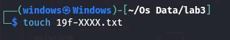

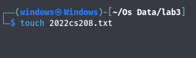

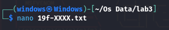

To enter content into the file, you have to write **nano fileName**. After writing content in the file, to save, you have to press **Ctrl+S**, and to exit from the editor, you have to press **Ctrl+X**. To see the content in the file, you have to write **cat fileName**.

## Merge content of one file into another

To merge the content of one file into another, you have to write the command **cat firstFileName >> SecondFileName**. It will append the content of one file to the other.

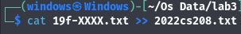

## Redirect the output to another file

If you want to create a new file after merging the content of two files, you should write **cat firstFileName SecondFileName > newFileName**. This will create a new file after appending content of one file to another file and write it into another file.

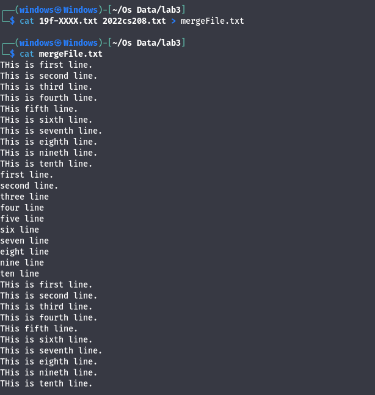

## Display first two lines of a file content

To display only the first two lines of a file, you have to write **head -n fileName** where **n** is the number of lines you want to display.

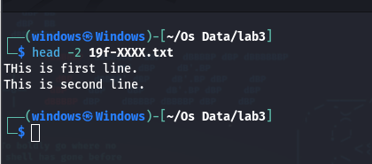

## Display last two lines of a file content

To display only the last two lines of a file, you have to write **tail -n fileName** where **n** is the number of lines you want to display.

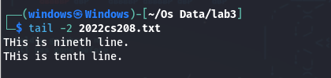

## Find text in a file

To find text in a file, write the command **grep "Text you want to find" fileName**.

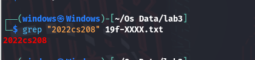

## Grant permission to a file or folder

To grant execution permission to a file or folder, you have to write the command **chmod g+x fileOrFolderName**. In the command, replace **u,g** with **user and group** respectively. Replace **x,r,w** with **execution, read, and write** permission respectively.

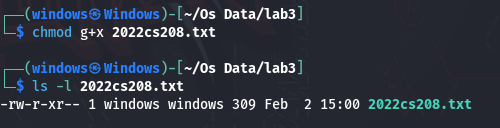 

## Remove permission from a file or folder

To remove execution permission from a file or folder, you have to write the command **chmod u-x fileOrFolderName**. In the command, replace **u,g** with **user and group** respectively. Replace **x,r,w** with **execution, read, and write** permission respectively. Use **ls -l fileOrFolderName** to see the present permissions of a file or folder.

 

## Present working directory

To see which directory you are currently working in, use the command **pwd** in the terminal.

## List/see files present in a specific location

To locate files in a specific path or directory(folder), use the command **ls path**

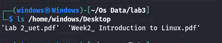

## Create a new folder or directory

To create a folder or directory in the present working directory, use the command **mkdir directoryName**.

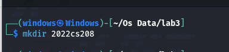

## Display current time

To display the current time, use the command **date**

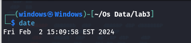

## Display any text on the terminal

To show some text on the terminal, write **echo textYouWantToShow**

# Task 2:

## Change permissions of a file with a number code

To change permissions of a file or folder using a number code, use the command **chmod numberCode fileOrFolderName**. 

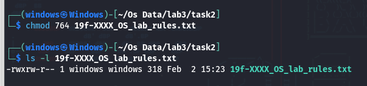

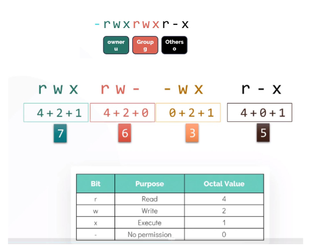

## Append content of a command to a file

To append the result of a command to a file, write **command >> fileName** as shown in the figure.

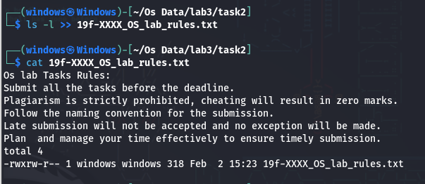
