# Task1:

## Taking command line arguments using shell script:

In order to take command line input from the command line you have to give input by following syntax **./Filename firstArgument secondArgument and so on** . You can pass multiple arguments to a file by using this syntax. 

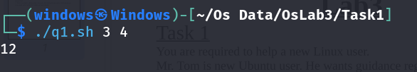

In Order to catch or get passed arguments from the command line in the file you have to use **$n** here **n** is number of argument you want to capture. For **First_Argument** use **$1** and so on.

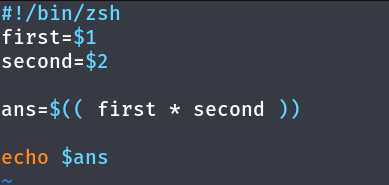

## Taking input in shell script:

In Order to get input in shell script file you have to use **read** before the name of **variable**. 

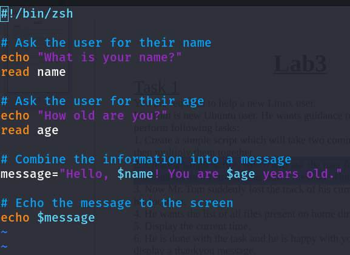

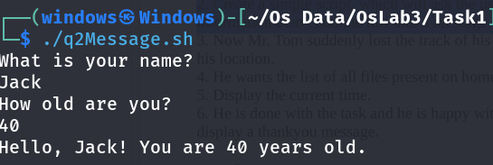

## Know current working directory:

To know in which you are present in the terminal you have to write **pwd**.

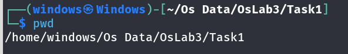

## List files and directories at specific location:

If you want to list all files and directories present in a specific directory write **ls [path of directory]**

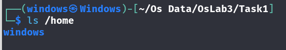

## Current time:

Get present time using command **date**

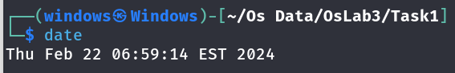

## Print in terminal:

In order to print anything on the terminal write **echo [ Message you want to print ]**

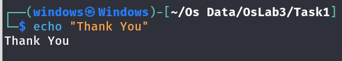

# Task2:

## Use of arithmetic operators in shell script:

Here is demo of using arithmetic operators in shell file.

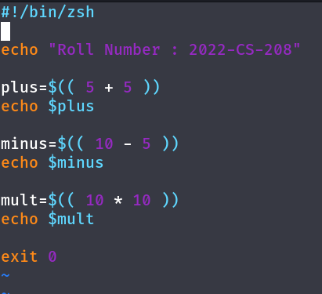

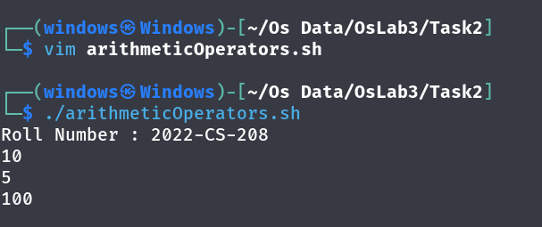

## All relational operators:

The use of all relational operators are given below.

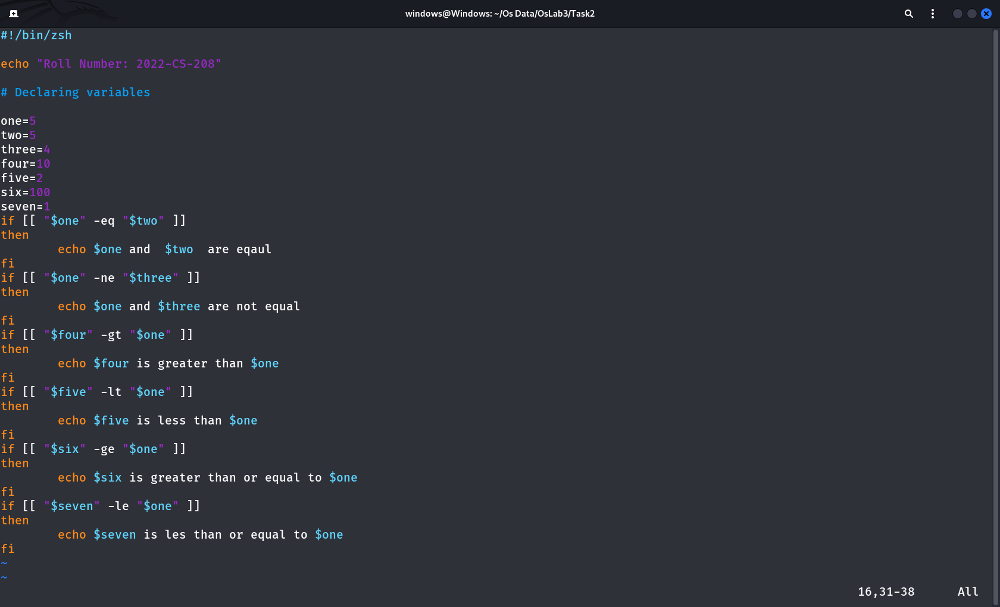

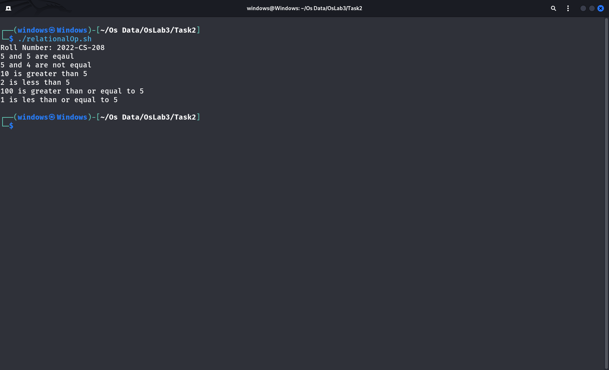